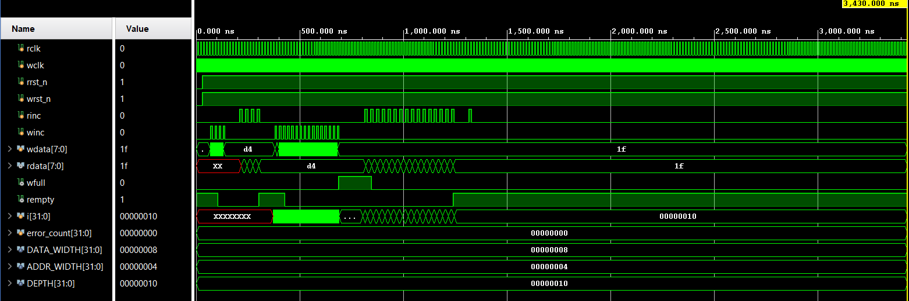

# Asynchronous FIFO RTL Design

## Overview

This project implements an **Asynchronous FIFO** in Verilog HDL. The FIFO is designed to safely transfer multi-bit data between two independent clock domains: a write clock domain and a read clock domain.

In digital systems, directly transferring multi-bit data between unrelated clocks can cause metastability and data corruption. This design avoids direct multi-bit CDC transfer by using FIFO memory, Gray-coded pointers, and two-flop synchronizers.

## Features

* Parameterized data width and address width
* Independent write and read clocks
* Synchronous write operation
* Synchronous read operation
* Binary read/write pointers for local address generation
* Gray-coded pointers for clock domain crossing
* Two-flop synchronizers for pointer synchronization
* Full flag generation in the write clock domain
* Empty flag generation in the read clock domain
* Functional verification using Verilog testbench
* Simulation verified using Xilinx Vivado

## Why Asynchronous FIFO is Needed

An asynchronous FIFO is used when data must be transferred between two modules operating on different clocks.

Examples include:

* Producer and consumer working on different clock domains
* Different clock frequencies
* Independent clock phases
* CDC-safe buffering in SoC designs
* Data transfer between high-speed and low-speed blocks

Instead of directly passing a multi-bit bus across clock domains, the FIFO stores the data in memory and synchronizes only the control pointers. This makes the transfer safer and more reliable.

## Architecture

The design is divided into multiple Verilog modules:

```text
Async_FIFO
├── fifo_mem       - Dual-clock FIFO memory
├── sync_pointer   - Two-flop synchronizer for Gray-coded pointers
├── wr_brain       - Write pointer, Gray conversion, and full logic
└── rd_brain       - Read pointer, Gray conversion, and empty logic
```

## Module Description

### 1. fifo_mem

This module stores the FIFO data.

It contains:

* Write clock
* Read clock
* Write enable
* Read enable
* Write address
* Read address
* Write data
* Read data

The memory uses synchronous write and synchronous read.

### 2. sync_pointer

This module synchronizes Gray-coded pointers from one clock domain to another using a two-flop synchronizer.

It is used in two directions:

```text
write Gray pointer → read clock domain
read Gray pointer  → write clock domain
```

Only Gray-coded pointers are synchronized because Gray code changes only one bit at a time, reducing the chance of incorrect pointer sampling across clock domains.

### 3. wr_brain

This module works in the write clock domain.

It performs:

* Binary write pointer increment
* Write address generation
* Binary-to-Gray conversion
* FIFO full flag generation

The binary pointer is used locally for memory addressing, while the Gray pointer is sent to the read clock domain.

### 4. rd_brain

This module works in the read clock domain.

It performs:

* Binary read pointer increment
* Read address generation
* Binary-to-Gray conversion
* FIFO empty flag generation

The binary pointer is used locally for memory addressing, while the Gray pointer is sent to the write clock domain.

## Pointer Logic

The FIFO uses two types of pointers:

```text
Binary pointer → used for address generation and increment
Gray pointer   → used for clock domain crossing
```

For a FIFO with address width `ADDR_WIDTH`, the actual pointer width is:

```text
PTR_WIDTH = ADDR_WIDTH + 1
```

The extra MSB is used to distinguish between full and empty conditions after pointer wrap-around.

## Binary to Gray Conversion

The binary pointer is converted to Gray code using:

```verilog
gray = (binary >> 1) ^ binary;
```

Gray code is useful in asynchronous FIFO design because only one bit changes between consecutive values. This makes pointer synchronization safer across clock domains.

## Empty Condition

The FIFO is empty when the next read Gray pointer becomes equal to the synchronized write Gray pointer:

```verilog
rempty_next = (rgray_next == rq2_wgray);
```

This means the read pointer has caught up with the write pointer.

## Full Condition

The FIFO is full when the next write Gray pointer equals the synchronized read Gray pointer with the top two bits inverted:

```verilog
wfull_next = (wgray_next == {~wq2_rgray[ADDR_WIDTH:ADDR_WIDTH-1],
                              wq2_rgray[ADDR_WIDTH-2:0]});
```

In binary pointer logic, full can be understood as the write pointer being one complete FIFO depth ahead of the read pointer. However, since the comparison is done in Gray code, the top two MSBs are inverted for full detection.

## Top-Level FIFO Interface

The top-level FIFO interface does not expose memory addresses to the user.

```verilog
module Async_FIFO #(
    parameter DATA_WIDTH = 8,
    parameter ADDR_WIDTH = 4
)(
    input  wire                  wclk,
    input  wire                  wrst_n,
    input  wire                  winc,
    input  wire [DATA_WIDTH-1:0] wdata,
    output wire                  wfull,

    input  wire                  rclk,
    input  wire                  rrst_n,
    input  wire                  rinc,
    output wire [DATA_WIDTH-1:0] rdata,
    output wire                  rempty
);
```

The user only provides write and read requests. Internally, the FIFO controller generates the memory addresses using read and write pointers.

## Simulation

The design was verified using a Verilog testbench in Vivado.

The testbench checks:

1. Reset behavior
2. FIFO empty after reset
3. FIFO not full after reset
4. Write and read data order
5. Full flag generation
6. Empty flag generation
7. Extra write attempt when FIFO is full
8. Extra read attempt when FIFO is empty

Two independent clocks were used:

```verilog
// Write clock period = 10 ns
always #5 wclk = ~wclk;

// Read clock period = 14 ns
always #7 rclk = ~rclk;
```

## Simulation Waveform

The waveform below shows the asynchronous FIFO simulation in Vivado.



The waveform verifies:

* Reset release
* Write enable pulses
* Read enable pulses
* Data write sequence
* Data read sequence
* Empty flag behavior
* Full flag behavior
* Successful FIFO operation with different read and write clocks

## Important Observations

* The read and write clocks are independent.
* The FIFO does not expose addresses externally.
* Write and read addresses are generated internally using binary pointers.
* Gray-coded pointers are synchronized across clock domains.
* The read data may initially show unknown values because the memory is uninitialized before a valid read.
* Since synchronous read memory is used, read data becomes valid after the read clock edge.

## Tools Used

* Verilog HDL
* Xilinx Vivado
* Behavioral Simulation

## Repository Files

```text
Async_FIFO.v      - Top-level asynchronous FIFO module
fifo_mem.v        - FIFO memory module
sync_pointer.v    - Two-flop pointer synchronizer
wr_brain.v        - Write-side pointer and full logic
rd_brain.v        - Read-side pointer and empty logic
Testbench.v       - Verilog testbench
waveform.png      - Vivado simulation waveform
README.md         - Project documentation
```

## Project Status

The asynchronous FIFO was successfully simulated and verified using Vivado behavioral simulation.

## Key Learning Outcomes

Through this project, I learned:

* Clock Domain Crossing concepts
* Metastability handling using synchronizers
* Difference between binary and Gray pointers
* Full and empty flag generation in asynchronous FIFO
* Importance of extra pointer bit for wrap-around detection
* Difference between synchronous and asynchronous FIFO
* Practical Verilog module-based RTL design
* Testbench-based verification in Vivado

## Future Improvements

Possible future improvements include:

* Adding almost full and almost empty flags
* Adding overflow and underflow error flags
* Adding randomized testbench
* Adding SystemVerilog assertions
* Adding formal verification
* Synthesizing the design on FPGA
